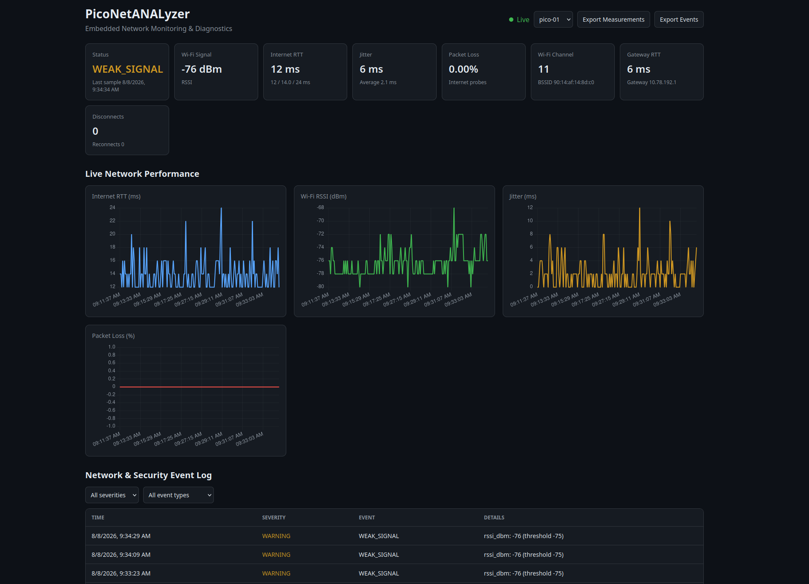

# PicoNetANALyzer

**PicoNetANALyzer** is a lightweight, always-on embedded network monitoring and diagnostics platform built around the **WIZnet WizFi360-EVB-Pico**.

The Pico continuously monitors Wi-Fi connectivity and network health, then sends structured telemetry over USB to a host computer. The host stores measurements and events in SQLite and provides a live browser dashboard.

The Pico itself does **not** store historical logs or CSV files. Historical data is stored on the host computer instead.

---

## Live Dashboard




## Features

### Network Monitoring

PicoNetANALyzer currently monitors:

* Wi-Fi SSID
* Access point BSSID
* Wi-Fi channel
* RSSI / signal strength
* Default gateway
* Gateway RTT
* Internet RTT
* Minimum RTT
* Average RTT
* Maximum RTT
* Jitter
* Average jitter
* Packet loss
* Wi-Fi disconnects
* Wi-Fi reconnects
* Reconnect attempts
* Device uptime

### Network Events

The firmware can detect and report:

* `DEVICE_STARTED`
* `WIFI_CONNECTED`
* `WIFI_CONNECT_FAILED`
* `WIFI_DISCONNECTED`
* `WIFI_RECONNECTED`
* `BSSID_CHANGED`
* `CHANNEL_CHANGED`
* `GATEWAY_CHANGED`
* `WEAK_SIGNAL`
* `HIGH_LATENCY`
* `HIGH_JITTER`
* `HIGH_PACKET_LOSS`
* `INTERNET_OUTAGE`
* `INTERNET_RECOVERED`
* `DNS_FAILURE`
* `DNS_RECOVERED`

Events are state-based where appropriate, so the Pico does not continuously generate duplicate alerts while the same condition remains active.

---

# Architecture

```text
                   Wi-Fi Network
                        │
                        ▼
                ┌───────────────┐
                │   WizFi360    │
                │               │
                │ Wi-Fi / AT    │
                └───────┬───────┘
                        │ UART
                        ▼
                ┌───────────────┐
                │    RP2040     │
                │               │
                │ Measurements  │
                │ Events        │
                │ Diagnostics   │
                └───────┬───────┘
                        │
                     USB Serial
                        │
                        ▼
                ┌───────────────┐
                │ collector.py  │
                └───────┬───────┘
                        │
                        ▼
                ┌───────────────┐
                │    SQLite     │
                │ piconet.db    │
                └───────┬───────┘
                        │
                        ▼
                ┌───────────────┐
                │ dashboard.py  │
                │    FastAPI    │
                └───────┬───────┘
                        │
                        ▼
                 Browser Dashboard
```

This keeps the embedded device lightweight.

The RP2040 only stores small amounts of temporary state in RAM. Long-term measurements and events are stored on the host computer.

---

# Hardware

Current target hardware:

* WIZnet WizFi360-EVB-Pico
* RP2040
* WizFi360 Wi-Fi module
* USB connection to host computer

The RP2040 communicates with the WizFi360 through UART:

```text
UART: uart1
TX:   GPIO 4
RX:   GPIO 5
Baud: 115200
```

---

# Project Structure

```text
PicoNetANALyzer/
│
├── firmware/
│   ├── main.c
│   ├── network_events.c
│   ├── network_events.h
│   ├── telemetry.c
│   ├── telemetry.h
│   ├── config.h
│   ├── config.example.h
│   ├── CMakeLists.txt
│   └── pico_sdk_import.cmake
│
├── host/
│   ├── collector.py
│   ├── dashboard.py
│   ├── requirements.txt
│   │
│   └── static/
│       ├── dashboard.html
│       └── dashboard.js
│
├── data/
│   └── .gitkeep
│
├── .gitignore
├── LICENSE
└── README.md
```

`firmware/config.h` contains local/private configuration and should **not** be committed to GitHub.

---

# Requirements

## Embedded Firmware

You will need:

* Raspberry Pi Pico SDK
* CMake
* Ninja or Make
* ARM GCC toolchain
* WIZnet WizFi360-EVB-Pico

Example Linux packages will depend on your distribution.

The project was developed using the Raspberry Pi Pico C/C++ SDK.

---

## Host Software

The host application requires:

* Python 3
* pyserial
* FastAPI
* Uvicorn
* SQLite

Python dependencies are listed in:

```text
host/requirements.txt
```

---

# Installation

## 1. Clone the Repository

```bash
git clone https://github.com/theprod45/PicoNetANALyzer.git

cd PicoNetANALyzer
```

---

# Firmware Setup

## 2. Create Your Configuration File

Move into the firmware directory:

```bash
cd firmware
```

Copy the configuration template:

```bash
cp config.example.h config.h
```

Edit:

```bash
nano config.h
```

Example:

```c
#ifndef CONFIG_H
#define CONFIG_H

#define DEVICE_ID "pico-01"

#define WIFI_SSID "YOUR_WIFI_SSID"
#define WIFI_PASSWORD "YOUR_WIFI_PASSWORD"

#define INTERNET_TARGET "1.1.1.1"

#define MONITOR_INTERVAL_MS 5000
#define RECONNECT_DELAY_MS 2000

#define WEAK_RSSI_THRESHOLD_DBM -75
#define HIGH_RTT_THRESHOLD_MS 150

#define HIGH_JITTER_THRESHOLD_MS 50

#define PACKET_LOSS_WINDOW_SIZE 12
#define PACKET_LOSS_MIN_SAMPLES 5
#define HIGH_PACKET_LOSS_THRESHOLD_PCT 20

#define INTERNET_FAILURE_THRESHOLD 2

#define DNS_TEST_DOMAIN "example.com"
#define DNS_FAILURE_THRESHOLD 2

#endif
```

---

## Configuration Parameters

### `DEVICE_ID`

```c
#define DEVICE_ID "pico-01"
```

Unique name for this PicoNetANALyzer sensor.

This allows multiple devices to eventually report into the same monitoring system.

Examples:

```text
pico-bedroom
pico-office
pico-lab
```

---

### `WIFI_SSID`

```c
#define WIFI_SSID "YOUR_WIFI_SSID"
```

Name of the Wi-Fi network the WizFi360 should connect to.

---

### `WIFI_PASSWORD`

```c
#define WIFI_PASSWORD "YOUR_WIFI_PASSWORD"
```

Password for the Wi-Fi network.

For an open network:

```c
#define WIFI_PASSWORD ""
```

---

### `INTERNET_TARGET`

```c
#define INTERNET_TARGET "1.1.1.1"
```

IP address used to test Internet connectivity and latency.

Using an IP address allows Internet connectivity to be tested independently from DNS.

---

### `MONITOR_INTERVAL_MS`

```c
#define MONITOR_INTERVAL_MS 5000
```

Time between monitoring cycles.

`5000` means approximately one cycle every 5 seconds.

---

### `RECONNECT_DELAY_MS`

```c
#define RECONNECT_DELAY_MS 2000
```

Delay before the firmware attempts Wi-Fi reconnection.

---

### `WEAK_RSSI_THRESHOLD_DBM`

```c
#define WEAK_RSSI_THRESHOLD_DBM -75
```

RSSI level that triggers a weak signal condition.

Example interpretation:

```text
-40 dBm    Very strong
-50 dBm    Strong
-60 dBm    Good
-70 dBm    Moderate
-80 dBm    Weak
```

RSSI values are negative, so lower values indicate a weaker signal.

---

### `HIGH_RTT_THRESHOLD_MS`

```c
#define HIGH_RTT_THRESHOLD_MS 150
```

Internet RTT that triggers a `HIGH_LATENCY` event.

---

### `HIGH_JITTER_THRESHOLD_MS`

```c
#define HIGH_JITTER_THRESHOLD_MS 50
```

Triggers `HIGH_JITTER` when the difference between consecutive successful Internet RTT measurements reaches this threshold.

---

### `PACKET_LOSS_WINDOW_SIZE`

```c
#define PACKET_LOSS_WINDOW_SIZE 12
```

Number of recent Internet probes used for rolling packet-loss detection.

At a 5-second monitoring interval, 12 samples represents roughly one minute.

---

### `PACKET_LOSS_MIN_SAMPLES`

```c
#define PACKET_LOSS_MIN_SAMPLES 5
```

Minimum number of probes required before the firmware is allowed to generate a high packet-loss event.

This helps avoid alerts immediately after startup.

---

### `HIGH_PACKET_LOSS_THRESHOLD_PCT`

```c
#define HIGH_PACKET_LOSS_THRESHOLD_PCT 20
```

Rolling packet-loss percentage that generates:

```text
HIGH_PACKET_LOSS
```

---

### `INTERNET_FAILURE_THRESHOLD`

```c
#define INTERNET_FAILURE_THRESHOLD 2
```

Number of consecutive failed Internet probes required before the firmware declares:

```text
INTERNET_OUTAGE
```

A single failed ping therefore does not automatically count as a confirmed outage.

---

### `DNS_TEST_DOMAIN`

```c
#define DNS_TEST_DOMAIN "example.com"
```

Domain used to test DNS resolution.

DNS is only tested when raw IP Internet connectivity is already working.

---

### `DNS_FAILURE_THRESHOLD`

```c
#define DNS_FAILURE_THRESHOLD 2
```

Number of consecutive failed DNS lookups required before declaring:

```text
DNS_FAILURE
```

---

# Building the Firmware

Set the Pico SDK location if required:

```bash
export PICO_SDK_PATH=/path/to/pico-sdk
```

From the firmware directory:

```bash
cmake -S . -B build -G Ninja

cmake --build build
```

The resulting UF2 file should appear inside:

```text
firmware/build/
```

---

# Flashing the Pico

1. Disconnect the board.
2. Hold the `BOOTSEL` button.
3. Connect the board through USB.
4. Release `BOOTSEL`.
5. The board should appear as a USB mass-storage device.
6. Copy the generated `.uf2` file onto the device.

The Pico will reboot and begin running PicoNetANALyzer.

---

# Structured Telemetry

PicoNetANALyzer uses **NDJSON** over USB serial.

NDJSON means:

> One complete JSON object per line.

This makes the protocol easy to parse and expand.

---

## Measurement Example

```json
{
  "schema": 1,
  "device_id": "pico-01",
  "type": "measurement",
  "uptime_ms": 124534,
  "status": "ONLINE",
  "ssid": "Example Network",
  "bssid": "aa:bb:cc:dd:ee:ff",
  "channel": 11,
  "rssi_dbm": -53,
  "gateway": "192.168.1.1",
  "gateway_rtt_ms": 5,
  "gateway_loss_pct": 0.0,
  "internet_rtt_ms": 21,
  "min_rtt_ms": 17,
  "avg_rtt_ms": 22.41,
  "max_rtt_ms": 51,
  "jitter_ms": 3,
  "avg_jitter_ms": 2.74,
  "packet_loss_pct": 0.0
}
```

---

## Event Example

```json
{
  "schema": 1,
  "device_id": "pico-01",
  "type": "event",
  "uptime_ms": 180234,
  "event": "HIGH_LATENCY",
  "severity": "warning",
  "details": {
    "metric": "internet_rtt_ms",
    "value": 327,
    "threshold": 150
  }
}
```

The host collector automatically timestamps each received record using the host computer's UTC clock.

---

# Host Setup

Return to the project root:

```bash
cd ..
```

Create a Python virtual environment:

```bash
python -m venv .venv
```

Activate it:

```bash
source .venv/bin/activate
```

Install dependencies:

```bash
python -m pip install -r host/requirements.txt
```

The requirements should include:

```text
pyserial>=3.5
fastapi
uvicorn[standard]
```

---

# Running the Collector

The collector is the only program that should communicate directly with the Pico's USB serial port.

Run:

```bash
python host/collector.py
```

Default serial device:

```text
/dev/ttyACM0
```

Default database:

```text
data/piconet.db
```

To specify another serial port:

```bash
python host/collector.py --port /dev/ttyACM1
```

To print every received measurement:

```bash
python host/collector.py --verbose
```

Normal event output may look like:

```text
[EVENT] INFO DEVICE_STARTED {}
[EVENT] INFO WIFI_CONNECTED {}
[EVENT] WARNING HIGH_LATENCY {'metric': 'internet_rtt_ms', 'value': 284, 'threshold': 150}
```

---

# Database

The collector creates:

```text
data/piconet.db
```

The database contains three main tables.

## `records`

Stores the complete original JSON received from the Pico.

This provides forward compatibility if newer firmware sends fields that an older collector does not yet understand.

---

## `measurements`

Stores structured network measurements.

Examples:

* RSSI
* BSSID
* channel
* Internet RTT
* gateway RTT
* jitter
* packet loss
* status
* event counters

---

## `events`

Stores network and security events.

Examples:

```text
BSSID_CHANGED
CHANNEL_CHANGED
HIGH_LATENCY
HIGH_JITTER
INTERNET_OUTAGE
DNS_FAILURE
```

---

# Running the Live Dashboard

Keep the collector running.

Open a **second terminal**.

From the project root:

```bash
source .venv/bin/activate
```

Start the FastAPI dashboard:

```bash
python -m uvicorn dashboard:app \
    --app-dir host \
    --host 127.0.0.1 \
    --port 8000 \
    --reload
```

Open a browser and visit:

```text
http://127.0.0.1:8000
```

---

# Dashboard Features

The live dashboard currently provides:

* Overall network status
* RSSI
* Internet RTT
* Gateway RTT
* Minimum / average / maximum RTT
* Jitter
* Packet loss
* Wi-Fi channel
* Current BSSID
* Disconnect count
* Reconnect count
* Live RTT graph
* Live RSSI graph
* Live jitter graph
* Live packet-loss graph
* Network/security event timeline
* Event severity filtering
* Event type filtering
* Multiple device selector
* CSV measurement export
* CSV event export

The browser automatically refreshes measurements and events.

---

# Dashboard API

The dashboard exposes a REST API.

## Current Status

```text
GET /api/status
```

---

## Devices

```text
GET /api/devices
```

---

## Measurements

```text
GET /api/measurements
```

Example:

```text
/api/measurements?limit=100
```

---

## Events

```text
GET /api/events
```

Examples:

```text
/api/events?severity=warning
```

```text
/api/events?event_type=BSSID_CHANGED
```

---

## Event Types

```text
GET /api/event-types
```

---

## Raw Telemetry

```text
GET /api/raw
```

Useful for debugging and future protocol development.

---

## API Documentation

FastAPI automatically provides interactive API documentation:

```text
http://127.0.0.1:8000/docs
```

---

# CSV Export

Measurements can be exported directly from the dashboard or from:

```text
/api/export/measurements.csv
```

Events can be exported from:

```text
/api/export/events.csv
```

CSV files are generated from the host SQLite database.

The Pico itself does not store CSV files.

---

# Metrics Explained

## RSSI

Received Signal Strength Indicator.

It measures Wi-Fi signal strength in dBm.

Example:

```text
-50 dBm = strong
-70 dBm = moderate
-80 dBm = weak
```

---

## BSSID

The BSSID identifies the specific Wi-Fi access point/radio currently serving the Pico.

This is different from the SSID.

Example:

```text
SSID:
Example Network

BSSID:
AA:BB:CC:11:22:33
```

A network may have many access points using the same SSID.

---

## Channel

The Wi-Fi radio channel currently being used.

BSSID and channel changes can help identify access-point roaming.

---

## Gateway RTT

Round-trip latency between the Pico and its default gateway.

Useful for distinguishing local network problems from Internet problems.

---

## Internet RTT

Round-trip latency between the Pico and:

```c
INTERNET_TARGET
```

---

## Min RTT

Best successful Internet RTT observed since boot.

---

## Average RTT

Average successful Internet RTT since boot.

Failed probes are not included.

---

## Max RTT

Worst successful Internet RTT observed since boot.

---

## Jitter

Current variation between consecutive successful Internet RTT measurements.

Example:

```text
20 ms
22 ms
70 ms
```

The jump from 22 ms to 70 ms produces:

```text
48 ms jitter
```

Large jitter can affect gaming, VoIP, remote desktop, and other real-time traffic.

---

## Packet Loss

Percentage of Internet probes that failed.

The firmware also maintains a small rolling loss window for detecting current high-packet-loss conditions.

---

# Event Types Explained

## `BSSID_CHANGED`

The Pico moved from one access point to another.

This may represent normal Wi-Fi roaming.

A BSSID change does **not** automatically indicate malicious activity.

---

## `CHANNEL_CHANGED`

The Wi-Fi channel changed.

Frequently accompanies AP roaming.

---

## `GATEWAY_CHANGED`

The default gateway IP changed.

May indicate legitimate DHCP/network topology changes and is recorded for diagnostic visibility.

---

## `WEAK_SIGNAL`

RSSI crossed below the configured weak-signal threshold.

---

## `HIGH_LATENCY`

Internet RTT crossed above the configured latency threshold.

---

## `HIGH_JITTER`

Jitter crossed above the configured threshold.

---

## `HIGH_PACKET_LOSS`

Recent Internet packet loss crossed above the configured rolling loss threshold.

---

## `WIFI_DISCONNECTED`

The Pico lost association with its Wi-Fi network.

---

## `WIFI_RECONNECTED`

Wi-Fi connectivity returned.

The event includes the duration of the outage.

---

## `INTERNET_OUTAGE`

Wi-Fi and the local gateway remain reachable, but repeated Internet probes fail.

This helps distinguish an upstream Internet outage from a Wi-Fi or local network failure.

---

## `INTERNET_RECOVERED`

Internet connectivity returned after a confirmed Internet outage.

The recovery event includes the outage duration.

---

## `DNS_FAILURE`

Raw IP Internet connectivity works, but DNS resolution repeatedly fails.

This allows PicoNetANALyzer to distinguish:

```text
Internet failure
```

from:

```text
DNS failure
```

---

## `DNS_RECOVERED`

DNS resolution began working again after a confirmed DNS failure.

---

# Diagnostic Model

PicoNetANALyzer attempts to identify where connectivity problems occur.

```text
Wi-Fi connected?
│
├── No
│   └── WIFI_DISCONNECTED
│
└── Yes
    │
    ▼
Gateway reachable?
│
├── No
│   └── LOCAL_NETWORK_ISSUE
│
└── Yes
    │
    ▼
Internet IP reachable?
│
├── No
│   └── INTERNET_OUTAGE
│
└── Yes
    │
    ▼
DNS working?
│
├── No
│   └── DNS_FAILURE
│
└── Yes
    │
    ▼
ONLINE
```

Performance warnings can additionally include:

```text
WEAK_SIGNAL
HIGH_LATENCY
HIGH_JITTER
HIGH_PACKET_LOSS
```

---

# Troubleshooting

## `/dev/ttyACM0` Is Busy

Only one process should open the Pico serial device.

Do not run:

```text
picocom
```

at the same time as:

```text
collector.py
```

Find processes using the device:

```bash
lsof /dev/ttyACM0
```

---

## Permission Denied on `/dev/ttyACM0`

Check:

```bash
ls -l /dev/ttyACM0
```

Your Linux distribution may require your user account to belong to a serial-device group such as `uucp` or `dialout`.

---

## Collector Cannot Find the Pico

Check:

```bash
ls /dev/ttyACM*
```

Then specify the correct port:

```bash
python host/collector.py --port /dev/ttyACM1
```

---

## Dashboard Shows No Data

Make sure the collector is running:

```bash
python host/collector.py
```

Check that the database exists:

```bash
ls -lh data/piconet.db
```

Then start the dashboard.

---

## FastAPI Cannot Be Imported

Activate the virtual environment:

```bash
source .venv/bin/activate
```

Then install dependencies:

```bash
python -m pip install -r host/requirements.txt
```

Run Uvicorn through the same Python environment:

```bash
python -m uvicorn dashboard:app \
    --app-dir host \
    --host 127.0.0.1 \
    --port 8000
```

---

## Inspect the Database Manually

Install SQLite CLI if required.

Open:

```bash
sqlite3 data/piconet.db
```

Recent measurements:

```sql
SELECT
    received_at,
    status,
    rssi_dbm,
    internet_rtt_ms,
    jitter_ms,
    packet_loss_pct
FROM measurements
ORDER BY record_id DESC
LIMIT 10;
```

Recent events:

```sql
SELECT
    received_at,
    event_type,
    severity,
    details_json
FROM events
ORDER BY record_id DESC
LIMIT 20;
```

Exit:

```text
.quit
```

---

# Data Storage

Runtime data should not be committed to GitHub.

Recommended `.gitignore` entries:

```gitignore
# Private configuration
firmware/config.h

# Firmware builds
firmware/build/
build/

# Python
.venv/
__pycache__/
*.pyc

# Runtime data
data/*.db
data/*.db-shm
data/*.db-wal
data/*.sqlite
data/*.csv
data/*.log

!data/.gitkeep
```

---

# Why Use an Embedded Probe?

PicoNetANALyzer is not intended to replace tools such as:

* Wireshark
* Nmap
* tcpdump
* full Linux network-monitoring systems

A Linux computer is significantly more powerful for deep packet inspection and active network analysis.

PicoNetANALyzer instead focuses on being:

* Small
* Low power
* Always on
* Dedicated
* Inexpensive
* Easy to deploy
* Suitable for multiple distributed probes
* Able to continuously report network health to a central dashboard

For example:

```text
                 Central Dashboard
                        │
          ┌─────────────┼─────────────┐
          │             │             │
       pico-01       pico-02       pico-03
       Bedroom       Office          Lab

       -72 dBm       -50 dBm       -57 dBm
       45 ms         20 ms         23 ms
       3% loss       0% loss       0% loss
```

This allows network behavior to be observed from multiple physical locations without deploying multiple laptops.

---

# Current Limitations

The WizFi360 is primarily controlled through an AT-command interface.

PicoNetANALyzer is therefore currently designed around:

* Connectivity monitoring
* Wi-Fi state monitoring
* RTT measurements
* DNS health
* Network-state events
* Basic security-relevant diagnostics

It is **not currently a raw Wi-Fi packet-capture platform** and should not be considered a replacement for Wireshark or a monitor-mode wireless adapter.

---

# Planned Features

Possible future additions include:

* Signal recovery events
* Latency recovery events
* High jitter recovery events
* Packet-loss recovery events
* Gateway unreachable/recovered events
* IP-address change detection
* Trusted BSSID lists
* Unknown AP detection
* Configurable event severity rules
* TCP service health monitoring
* DNS latency measurement
* Historical dashboard ranges
* 5 minute / 1 hour / 24 hour views
* Event statistics
* Network health score
* Multi-Pico comparison dashboard
* Remote telemetry
* Alerting
* Event correlation
* Automatic diagnostic summaries
* Anomaly detection based on historical baselines
* OLED / LED status output
* Environmental sensors
* Host-side retention controls

---

# Security and Responsible Use

PicoNetANALyzer is intended for:

* Network diagnostics
* Network observability
* Education
* Research
* Monitoring networks you own
* Authorized security testing

Only test or monitor networks and systems that you own or have explicit permission to assess.

Network events such as BSSID or gateway changes should be treated as diagnostic indicators and not automatically interpreted as evidence of malicious activity.

---

# Development Philosophy

PicoNetANALyzer separates functionality into layers:

```text
Firmware
    │
    ├── Network measurements
    ├── Event detection
    └── Structured telemetry
            │
            ▼
Collector
    │
    └── Data ingestion
            │
            ▼
SQLite
    │
    └── Historical storage
            │
            ▼
FastAPI
    │
    └── Query / export API
            │
            ▼
Dashboard
    │
    └── Live visualization
```

This architecture is intended to make new features easy to add without turning the firmware or host application into one large monolithic program.

---

# License

See the `LICENSE` file for licensing information.

